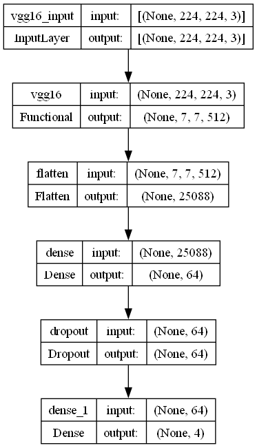
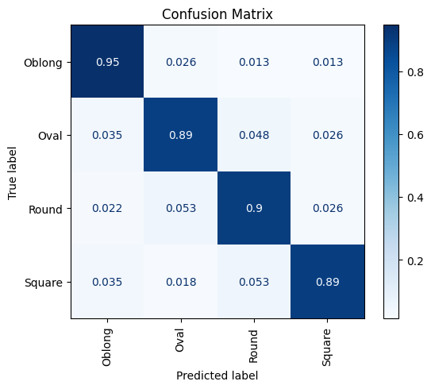

# Datasets
Kaggle Face Shape Datasets (except Heart)

Download : https://www.kaggle.com/datasets/niten19/face-shape-dataset

# Setting
- CPU : AMD Ryzen 9 7900 12-Core Processor
- GPU : RTX 4070 Super (VRAM 12 GB)
- SYSTEM : x64 based processor
- Windows 11
---
- CUDA Version : 11.2
- NVDIA Driver Version : 566.14
- cuDNN Version : 8.1.0
---
- Python Version : 3.10.11
- tensorflow Version : 2.10.0
---
⚠️ Docker 환경에서 학습하지 않았으므로 위에서 제시한 학습 환경과 동일한지 확인 필수

# Description
## 1. Prepare_Datasets.ipynb
- 파일 확장자 통일
- 파일명 형식 통일
## 2. Image_Preprocessing.ipynb
- 비율 유지하며 resize & crop
- MTCNN 활용하여 얼굴 탐지
- Train : Validation : Test Split
## 3. Transfer_Learning.ipynb
- VGG-16 기반 전이학습 수행
- 모델을 tflite 변환

# Model Structure

# Train Result

모든 클래스에서 약 90%의 정확도를 보임